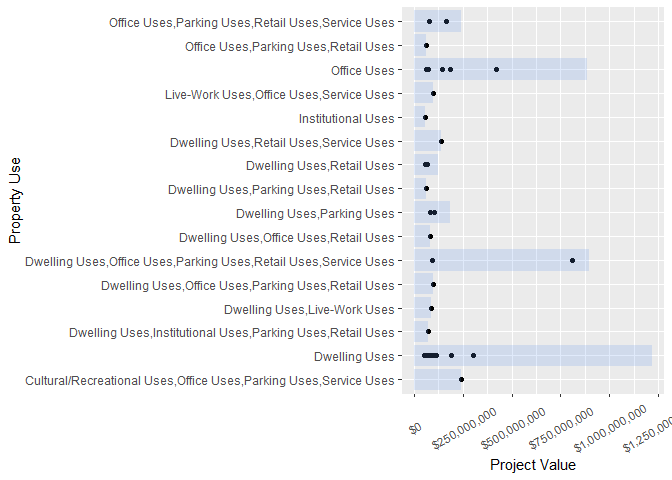
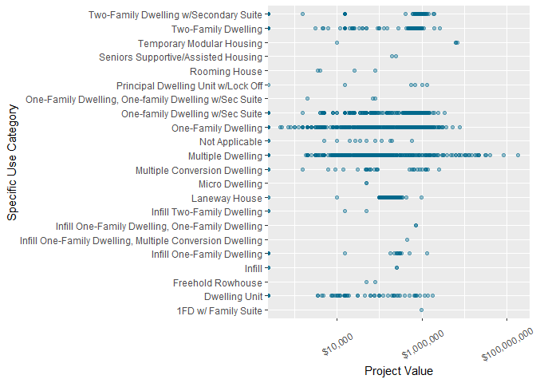
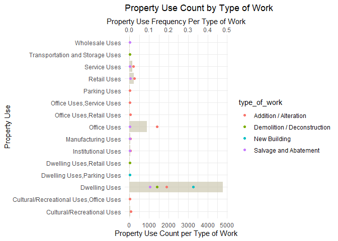
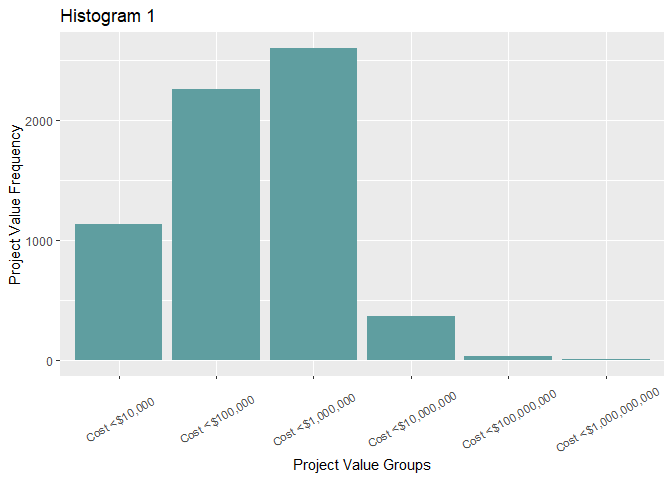
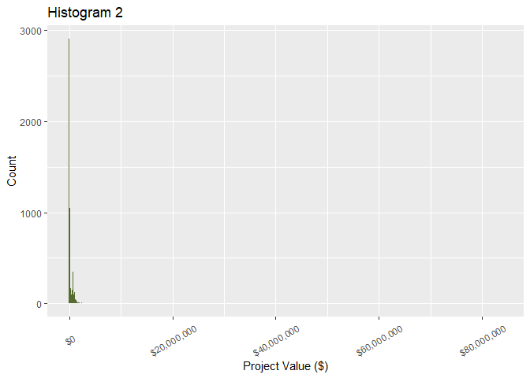
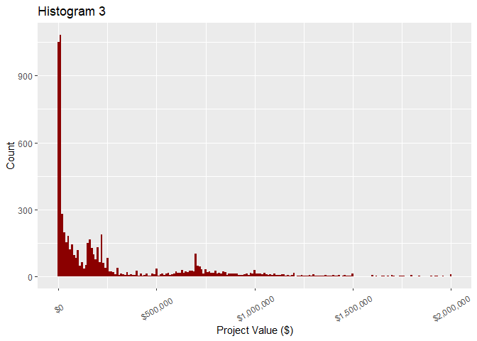

Mini Data Analysis Milestone 2
================

*To complete this milestone, you can either edit [this `.rmd`
file](https://raw.githubusercontent.com/UBC-STAT/stat545.stat.ubc.ca/master/content/mini-project/mini-project-2.Rmd)
directly. Fill in the sections that are commented out with
`<!--- start your work here--->`. When you are done, make sure to knit
to an `.md` file by changing the output in the YAML header to
`github_document`, before submitting a tagged release on canvas.*

# Welcome to the rest of your mini data analysis project!

In Milestone 1, you explored your data. and came up with research
questions. This time, we will finish up our mini data analysis and
obtain results for your data by:

- Making summary tables and graphs
- Manipulating special data types in R: factors and/or dates and times.
- Fitting a model object to your data, and extract a result.
- Reading and writing data as separate files.

We will also explore more in depth the concept of *tidy data.*

**NOTE**: The main purpose of the mini data analysis is to integrate
what you learn in class in an analysis. Although each milestone provides
a framework for you to conduct your analysis, it’s possible that you
might find the instructions too rigid for your data set. If this is the
case, you may deviate from the instructions – just make sure you’re
demonstrating a wide range of tools and techniques taught in this class.

# Instructions

**To complete this milestone**, edit [this very `.Rmd`
file](https://raw.githubusercontent.com/UBC-STAT/stat545.stat.ubc.ca/master/content/mini-project/mini-project-2.Rmd)
directly. Fill in the sections that are tagged with
`<!--- start your work here--->`.

**To submit this milestone**, make sure to knit this `.Rmd` file to an
`.md` file by changing the YAML output settings from
`output: html_document` to `output: github_document`. Commit and push
all of your work to your mini-analysis GitHub repository, and tag a
release on GitHub. Then, submit a link to your tagged release on canvas.

**Points**: This milestone is worth 50 points: 45 for your analysis, and
5 for overall reproducibility, cleanliness, and coherence of the Github
submission.

**Research Questions**: In Milestone 1, you chose two research questions
to focus on. Wherever realistic, your work in this milestone should
relate to these research questions whenever we ask for justification
behind your work. In the case that some tasks in this milestone don’t
align well with one of your research questions, feel free to discuss
your results in the context of a different research question.

# Learning Objectives

By the end of this milestone, you should:

- Understand what *tidy* data is, and how to create it using `tidyr`.
- Generate a reproducible and clear report using R Markdown.
- Manipulating special data types in R: factors and/or dates and times.
- Fitting a model object to your data, and extract a result.
- Reading and writing data as separate files.

# Setup

Begin by loading your data and the tidyverse package below:

``` r
library(datateachr) # <- might contain the data you picked!
library(tidyverse)
library(dplyr)
library(ggplot2)
library(scales)
library(stringr)
library(broom)
library(here)
```

# Task 1: Process and summarize your data

From milestone 1, you should have an idea of the basic structure of your
dataset (e.g. number of rows and columns, class types, etc.). Here, we
will start investigating your data more in-depth using various data
manipulation functions.

### 1.1 (1 point)

First, write out the 4 research questions you defined in milestone 1
were. This will guide your work through milestone 2:

<!-------------------------- Start your work below ---------------------------->

1.  How is money distributed across property_use for large projects,
    above \$50,000,000?
2.  How is money distributed across specific_use_catagory for dwellings?
3.  What is the relationship between type_of_work and property_use?
4.  Has the type_of_work for dwellings changed over time?
    <!----------------------------------------------------------------------------->

Here, we will investigate your data using various data manipulation and
graphing functions.

### 1.2 (8 points)

Now, for each of your four research questions, choose one task from
options 1-4 (summarizing), and one other task from 4-8 (graphing). You
should have 2 tasks done for each research question (8 total). Make sure
it makes sense to do them! (e.g. don’t use a numerical variables for a
task that needs a categorical variable.). Comment on why each task helps
(or doesn’t!) answer the corresponding research question.

Ensure that the output of each operation is printed!

Also make sure that you’re using dplyr and ggplot2 rather than base R.
Outside of this project, you may find that you prefer using base R
functions for certain tasks, and that’s just fine! But part of this
project is for you to practice the tools we learned in class, which is
dplyr and ggplot2.

**Summarizing:**

1.  Compute the *range*, *mean*, and *two other summary statistics* of
    **one numerical variable** across the groups of **one categorical
    variable** from your data.
2.  Compute the number of observations for at least one of your
    categorical variables. Do not use the function `table()`!
3.  Create a categorical variable with 3 or more groups from an existing
    numerical variable. You can use this new variable in the other
    tasks! *An example: age in years into “child, teen, adult, senior”.*
4.  Compute the proportion and counts in each category of one
    categorical variable across the groups of another categorical
    variable from your data. Do not use the function `table()`!

**Graphing:**

6.  Create a graph of your choosing, make one of the axes logarithmic,
    and format the axes labels so that they are “pretty” or easier to
    read.
7.  Make a graph where it makes sense to customize the alpha
    transparency.

Using variables and/or tables you made in one of the “Summarizing”
tasks:

8.  Create a graph that has at least two geom layers.
9.  Create 3 histograms, with each histogram having different sized
    bins. Pick the “best” one and explain why it is the best.

Make sure it’s clear what research question you are doing each operation
for!

<!------------------------- Start your work below ----------------------------->

\###Research Question 1:

How is money distributed across property_use for large projects, above
\$50,000,000?

*operations 1 & 7* Operation 1 offers some insight into research
question 1, providing summary statistics for the project_value of each
property_use above \$50,000,000. However, I believe operation 7 offers
more insight. The graph shows the value of individual projects, showing
how many fall in each property_use, as well as data such as max and min
project_value. It also shows total money associated with each
property_use. I think the visual representation is easier to follow and
conveys more information, helping to answer the research question.

``` r
building_permits %>%
  filter(project_value >= 50000000) %>%
  group_by(property_use) %>%
  summarize(Mean = mean(project_value, na.rm=TRUE), Median = median(project_value), SD = sd(project_value), Range = max(project_value) - min(project_value))
```

    ## # A tibble: 16 × 5
    ##    property_use                                       Mean Median      SD  Range
    ##    <chr>                                             <dbl>  <dbl>   <dbl>  <dbl>
    ##  1 Cultural/Recreational Uses,Office Uses,Parking … 2.40e8 2.40e8 NA      0     
    ##  2 Dwelling Uses                                    1.11e8 8.5 e7  7.30e7 2.5 e8
    ##  3 Dwelling Uses,Institutional Uses,Parking Uses,R… 7.28e7 7.28e7 NA      0     
    ##  4 Dwelling Uses,Live-Work Uses                     8.84e7 8.84e7 NA      0     
    ##  5 Dwelling Uses,Office Uses,Parking Uses,Retail U… 9.98e7 9.98e7 NA      0     
    ##  6 Dwelling Uses,Office Uses,Parking Uses,Retail U… 4.49e8 4.49e8  5.07e8 7.17e8
    ##  7 Dwelling Uses,Office Uses,Retail Uses            8   e7 8   e7 NA      0     
    ##  8 Dwelling Uses,Parking Uses                       9.32e7 9.32e7  1.30e7 1.84e7
    ##  9 Dwelling Uses,Parking Uses,Retail Uses           6   e7 6   e7 NA      0     
    ## 10 Dwelling Uses,Retail Uses                        6.15e7 6.15e7  4.95e6 7   e6
    ## 11 Dwelling Uses,Retail Uses,Service Uses           1.39e8 1.39e8 NA      0     
    ## 12 Institutional Uses                               5.62e7 5.62e7 NA      0     
    ## 13 Live-Work Uses,Office Uses,Service Uses          9.60e7 9.60e7 NA      0     
    ## 14 Office Uses                                      1.77e8 1.46e8  1.45e8 3.58e8
    ## 15 Office Uses,Parking Uses,Retail Uses             6.37e7 6.37e7 NA      0     
    ## 16 Office Uses,Parking Uses,Retail Uses,Service Us… 1.20e8 1.20e8  6.36e7 9   e7

``` r
building_permits %>%
  filter(project_value >= 50000000) %>%
  group_by(property_use) %>%
  ggplot(aes(project_value, property_use)) +
  geom_point() +
  scale_x_continuous(labels = scales::dollar_format()) +
  xlab("Project Value") +
  ylab("Property Use") +
  theme(axis.text.x = element_text(angle = 30, hjust = 0.5, vjust = 0.5)) +
  geom_col(alpha = 0.2, fill = "cornflowerblue")
```

<!-- -->

\###Research Question 2:

How is money distributed across specific_use_category for dwellings?

*operations 2 & 6* The output from operation 2 displays how many counts
there are for each specific_use_category, within dwelling uses for
property_use. This gives some insight into the number of projects for
each specific_use_category, however it does not show the distribution of
money across these categories. Operation 6 creates a graph that shows
project_value, or the amount of money associated with each project,
across specific_use_categories. A log scale was used to better display
values as without it there is little resolution seen between lower
values. With it, the distribution of project_value can be better
visualized.

``` r
building_permits %>%
  filter(property_use == "Dwelling Uses") %>%
  count(specific_use_category)
```

    ## # A tibble: 38 × 2
    ##    specific_use_category                                n
    ##    <chr>                                            <int>
    ##  1 1FD on Sites w/ More Than One Principal Building     1
    ##  2 1FD w/ Family Suite                                 10
    ##  3 2FD on Sites w/ Mult Principal Bldg                  3
    ##  4 Dwelling Unit                                      119
    ##  5 Dwelling Unit w/ Other Use                          15
    ##  6 Dwelling Unit, One-Family Dwelling                   2
    ##  7 Freehold Rowhouse                                    3
    ##  8 Infill                                               8
    ##  9 Infill Multiple Dwelling                             2
    ## 10 Infill One-Family Dwelling                          74
    ## # ℹ 28 more rows

``` r
building_permits %>%
  filter(property_use == "Dwelling Uses") %>%
  group_by(specific_use_category) %>%
  drop_na() %>%
  ggplot(aes(project_value, specific_use_category)) +
  geom_point(color = "deepskyblue4", alpha = 0.4) +
  scale_x_log10(labels = scales::dollar_format()) +
  xlab("Project Value") +
  ylab("Specific Use Category") +
  theme(axis.text.x = element_text(angle = 30, hjust = 0.5, vjust = 0.5))
```

    ## Warning: Transformation introduced infinite values in continuous x-axis

<!-- -->

\###Research Question 3:

What is the relationship between type_of_work and property_use?

*operations 4 & 8* Operation 4 produces a table which displays the
number of counts for each property_use, across type_of_work, as well as
the relative frequency of each count compared to total count. Counts of
less than 5 were filtered out to remove niche, one off use cases that
are less relevant when looking at the larger picture. This summary gives
insight, however would be more readable in a visual format. Operation
8’s graph shows the data from the table visually, dsiplaying the count
of property_use grouped by type_of_work, as well as the frequency of
each property_use per type_of_work. Though more in depth detail can be
seen within the table, the graph allows an easily readable view of the
data.

``` r
PU_across_ToW <- building_permits %>%
  group_by(type_of_work, property_use) %>%
  drop_na() %>%
  summarise(n = n()) %>%
  filter(n >=5) %>%
  ungroup() %>%
  mutate(freq = n / sum(n))
```

    ## `summarise()` has grouped output by 'type_of_work'. You can override using the
    ## `.groups` argument.

``` r
PU_across_ToW
```

    ## # A tibble: 31 × 4
    ##    type_of_work          property_use                               n     freq
    ##    <chr>                 <chr>                                  <int>    <dbl>
    ##  1 Addition / Alteration Cultural/Recreational Uses                44 0.00700 
    ##  2 Addition / Alteration Cultural/Recreational Uses,Office Uses     5 0.000796
    ##  3 Addition / Alteration Dwelling Uses                           1194 0.190   
    ##  4 Addition / Alteration Dwelling Uses,Retail Uses                  9 0.00143 
    ##  5 Addition / Alteration Institutional Uses                        27 0.00430 
    ##  6 Addition / Alteration Manufacturing Uses                        29 0.00461 
    ##  7 Addition / Alteration Office Uses                              884 0.141   
    ##  8 Addition / Alteration Office Uses,Retail Uses                   22 0.00350 
    ##  9 Addition / Alteration Office Uses,Service Uses                   9 0.00143 
    ## 10 Addition / Alteration Parking Uses                               6 0.000955
    ## # ℹ 21 more rows

``` r
ggplot(PU_across_ToW, aes(property_use, n)) +
  geom_col(fill = "cornsilk3", alpha = 0.7) +
  coord_flip() +
  geom_point(aes(property_use, y = freq*10000, color = type_of_work)) +
  guides(fill = guide_legend(title="Type of Work")) +
  xlab("Property Use") +
  ggtitle("Property Use Count by Type of Work") +
  theme_minimal() +
  scale_y_continuous(name = "Property Use Count per Type of Work", sec.axis = sec_axis(trans=~./10000,  name="Property Use Frequency Per Type of Work"))
```

<!-- -->

\###Research Question 4:

Has the type_of_work for dwellings changed over time?

Unforunately, I found it difficult to fit this research question into
the remaining operations, so I came up with a new fourth research
question: *How is project_value distributed?*

*operations 3 & 9* In operation 3, I created a new variable,
“project_value_groups”, which grouped the numerical variable
project_value into a new factor variable separated into larger value
bins. Following this, I created three histograms. Histogram 1 plotted
the distribution of counts for the project_value_groups, while histogram
2 and 3 plotted the distribution of project_value, with bin widths of
100,000 and 10,000 respectively. Histogram 2 and 3 had to be filtered in
order to better view the data, as the infrequency of large-cost projects
lead to crunching up of data on the left side of the graph. I believe
histogram 1 is the best, as it gives a snapshot into the project values
within bins that share generally similar values. This allows a viewer to
see the distribution of projects across general value bins, giving
better insight into those frequencies, at the cost of resolution.
However, given the loss of data in the higher resolution graphs, I
believe this offers more despite the lower resolution. When it comes to
answering the question, I believe histogram 1 does a good job at
offering a simple, clear visualization of the distribution of project
value.

``` r
building_permits$project_value_groups <- as.factor(
  ifelse(building_permits$project_value<10000, 'Cost <$10,000', 
  ifelse(building_permits$project_value<100000, 'Cost <$100,000', 
  ifelse(building_permits$project_value<1000000, 'Cost <$1,000,000', 
  ifelse(building_permits$project_value<10000000, 'Cost <$10,000,000',
  ifelse(building_permits$project_value<100000000, 'Cost <$100,000,000',
  ifelse(building_permits$project_value<1000000000, 'Cost <$1,000,000,000',
  )))))))

building_permits %>%
  drop_na() %>%
  ggplot(aes(x=factor(project_value_groups, level=c('Cost <$10,000', 'Cost <$100,000', 'Cost <$1,000,000', 'Cost <$10,000,000', 'Cost <$100,000,000', 'Cost <$1,000,000,000')))) +
  geom_histogram(fill = "cadetblue", stat = "Count") +
  xlab("Project Value Groups") +
  ylab("Project Value Frequency") +
  ggtitle("Histogram 1") +
  theme(axis.text.x = element_text(angle = 30, hjust = 0.5, vjust = 0.5))
```

    ## Warning in geom_histogram(fill = "cadetblue", stat = "Count"): Ignoring unknown
    ## parameters: `binwidth`, `bins`, and `pad`

<!-- -->

``` r
building_permits %>%
  drop_na() %>%
  filter(project_value <= 100000000) %>%
  ggplot(aes(project_value)) +
  geom_histogram(fill = "darkolivegreen", binwidth = 100000) +
  xlab("Project Value ($)") +
  ylab("Count") +
  ggtitle("Histogram 2") +
  scale_x_continuous(labels = scales::dollar_format()) +
  theme(axis.text.x = element_text(angle = 30, hjust = 0.5, vjust = 0.5))
```

<!-- -->

``` r
building_permits %>%
  drop_na() %>%
  filter(project_value <= 2000000) %>%
  ggplot(aes(project_value)) +
  geom_histogram(fill = "darkred", binwidth = 10000) +
  xlab("Project Value ($)") +
  ylab("Count") +
  ggtitle("Histogram 3") +
  scale_x_continuous(labels = scales::dollar_format()) +
  theme(axis.text.x = element_text(angle = 30, hjust = 0.5, vjust = 0.5))
```

<!-- -->

<!----------------------------------------------------------------------------->

### 1.3 (2 points)

Based on the operations that you’ve completed, how much closer are you
to answering your research questions? Think about what aspects of your
research questions remain unclear. Can your research questions be
refined, now that you’ve investigated your data a bit more? Which
research questions are yielding interesting results?

<!------------------------- Write your answer here ---------------------------->

I think my first three research questions are close to having answers.
Relationships were visualized well in graphs, and summarizing operations
were used to support this. Unfortunately, I could not fit research
question 4 into the available operations, leaving it without any
answers. I did however focus on a new fourth research question as a
result, which I felt is closer to an answer following the operations.
Following initial investigations, I think questions could be refined
slightly, but I also think in some instances more work could be done to
get closer to answers for the existing questions. I think research
question \#1 is showing some interesting results, as the graph is able
to cohesively display some relationships, though data is skewed due to
low sample size. Moreover, I think research question \#2 is showing some
interesting preliminary relationships that show how further exploration
or modeling could show really fascinating results.

<!----------------------------------------------------------------------------->

# Task 2: Tidy your data

In this task, we will do several exercises to reshape our data. The goal
here is to understand how to do this reshaping with the `tidyr` package.

A reminder of the definition of *tidy* data:

- Each row is an **observation**
- Each column is a **variable**
- Each cell is a **value**

### 2.1 (2 points)

Based on the definition above, can you identify if your data is tidy or
untidy? Go through all your columns, or if you have \>8 variables, just
pick 8, and explain whether the data is untidy or tidy.

<!--------------------------- Start your work below --------------------------->

``` r
head(building_permits)
```

    ## # A tibble: 6 × 15
    ##   permit_number issue_date project_value type_of_work          address          
    ##   <chr>         <date>             <dbl> <chr>                 <chr>            
    ## 1 BP-2016-02248 2017-02-01             0 Salvage and Abatement 4378 W 9TH AVENU…
    ## 2 BU468090      2017-02-01             0 New Building          1111 RICHARDS ST…
    ## 3 DB-2016-04450 2017-02-01         35000 Addition / Alteration 3732 W 12TH AVEN…
    ## 4 DB-2017-00131 2017-02-01         15000 Addition / Alteration 88 W PENDER STRE…
    ## 5 DB452250      2017-02-01        181178 New Building          492 E 62ND AVENU…
    ## 6 BP-2016-01458 2017-02-02             0 Salvage and Abatement 3332 W 28TH AVEN…
    ## # ℹ 10 more variables: project_description <chr>, building_contractor <chr>,
    ## #   building_contractor_address <chr>, applicant <chr>,
    ## #   applicant_address <chr>, property_use <chr>, specific_use_category <chr>,
    ## #   year <dbl>, bi_id <dbl>, project_value_groups <fct>

I believe this data set is tidy because the each cell is a value, each
row is an observation, and each column is a variable.

<!----------------------------------------------------------------------------->

### 2.2 (4 points)

Now, if your data is tidy, untidy it! Then, tidy it back to it’s
original state.

If your data is untidy, then tidy it! Then, untidy it back to it’s
original state.

Be sure to explain your reasoning for this task. Show us the “before”
and “after”.

<!--------------------------- Start your work below --------------------------->

\#####Before, tidy:

type_of_work and property_use were selected as the data set has 15
columns, thus our columns of interest are typically hidden. Here they
are displayed to show their current, tidy state.

``` r
building_permits_display <- select(building_permits, permit_number, type_of_work, property_use)

head(building_permits_display)
```

    ## # A tibble: 6 × 3
    ##   permit_number type_of_work          property_use           
    ##   <chr>         <chr>                 <chr>                  
    ## 1 BP-2016-02248 Salvage and Abatement Dwelling Uses          
    ## 2 BU468090      New Building          Dwelling Uses          
    ## 3 DB-2016-04450 Addition / Alteration Dwelling Uses          
    ## 4 DB-2017-00131 Addition / Alteration Office Uses,Retail Uses
    ## 5 DB452250      New Building          Dwelling Uses          
    ## 6 BP-2016-01458 Salvage and Abatement Dwelling Uses

\#####After, untidy:

building_permits was widened to create an untidy dataset by displaying
property_use values across multiple different columns derived from
type_of_work, then new columns were selected to easily view columns
displaying untidy state. This made the data set untidy as there are now
new columns that are not variables, but rather observations.

``` r
building_permits_untidy <- building_permits %>%
  pivot_wider(names_from = type_of_work,
              values_from = property_use)

building_permits_untidy_display <- select(building_permits_untidy, permit_number, `Salvage and Abatement`, `New Building`, `Addition / Alteration`, `Demolition / Deconstruction`, `Temporary Building / Structure`, `Outdoor Uses (No Buildings Proposed)`)

head(building_permits_untidy_display)
```

    ## # A tibble: 6 × 7
    ##   permit_number `Salvage and Abatement` `New Building` `Addition / Alteration`
    ##   <chr>         <chr>                   <chr>          <chr>                  
    ## 1 BP-2016-02248 Dwelling Uses           <NA>           <NA>                   
    ## 2 BU468090      <NA>                    Dwelling Uses  <NA>                   
    ## 3 DB-2016-04450 <NA>                    <NA>           Dwelling Uses          
    ## 4 DB-2017-00131 <NA>                    <NA>           Office Uses,Retail Uses
    ## 5 DB452250      <NA>                    Dwelling Uses  <NA>                   
    ## 6 BP-2016-01458 Dwelling Uses           <NA>           <NA>                   
    ## # ℹ 3 more variables: `Demolition / Deconstruction` <chr>,
    ## #   `Temporary Building / Structure` <chr>,
    ## #   `Outdoor Uses (No Buildings Proposed)` <chr>

\#####Back to original state, tidy:

The new columns generated in the previous step are now lengthened into
their original, tidy state. Once again columns were selected for easier
display. This tidied the data set as once again all columns are
variables, rows are aobservations, and cells are values.

``` r
building_permits_retidy <- building_permits_untidy %>%
  pivot_longer(cols = c(`Salvage and Abatement`:`Outdoor Uses (No Buildings Proposed)`), 
               names_to  = "type_of_work", 
               values_to = "property_use",
               values_drop_na = TRUE)

building_permits_retidy_display <- select(building_permits, permit_number, type_of_work, property_use)

head(building_permits_retidy_display)
```

    ## # A tibble: 6 × 3
    ##   permit_number type_of_work          property_use           
    ##   <chr>         <chr>                 <chr>                  
    ## 1 BP-2016-02248 Salvage and Abatement Dwelling Uses          
    ## 2 BU468090      New Building          Dwelling Uses          
    ## 3 DB-2016-04450 Addition / Alteration Dwelling Uses          
    ## 4 DB-2017-00131 Addition / Alteration Office Uses,Retail Uses
    ## 5 DB452250      New Building          Dwelling Uses          
    ## 6 BP-2016-01458 Salvage and Abatement Dwelling Uses

<!----------------------------------------------------------------------------->

### 2.3 (4 points)

Now, you should be more familiar with your data, and also have made
progress in answering your research questions. Based on your interest,
and your analyses, pick 2 of the 4 research questions to continue your
analysis in the remaining tasks:

<!-------------------------- Start your work below ---------------------------->

1.  *How is money distributed across specific_use_category for
    dwellings?*
2.  *Has the type_of_work for dwellings changed over time?*

<!----------------------------------------------------------------------------->

Explain your decision for choosing the above two research questions.

<!--------------------------- Start your work below --------------------------->

I chose the above research questions because I believe further analyses
could work towards answering these questions. This is especially true in
the case of the second question above, as the previous operations
specified in task 1.2 did not fit well with answering it, thus this is
an opportunity to work towards this research question.

<!----------------------------------------------------------------------------->

Now, try to choose a version of your data that you think will be
appropriate to answer these 2 questions. Use between 4 and 8 functions
that we’ve covered so far (i.e. by filtering, cleaning, tidy’ing,
dropping irrelevant columns, etc.).

(If it makes more sense, then you can make/pick two versions of your
data, one for each research question.)

<!--------------------------- Start your work below --------------------------->

This version of my data has been filtered to only include dwelling uses
for property_use as both questions require this filter, and filtered out
project_values to be \>0, in order to constrain data to projects with
value to attached. Next, only columns with potential relevence to the
questions were selected, removing extraneous variables. Finally, the
data was arranged by bi_id for ease of viewing in future tables.

``` r
building_permits_2.3 <- building_permits %>%
  filter(property_use == "Dwelling Uses") %>%
  filter(project_value >0) %>%
  select(permit_number, project_value, property_use, specific_use_category, type_of_work, year, bi_id) %>%
  arrange(bi_id)

head(building_permits_2.3)
```

    ## # A tibble: 6 × 7
    ##   permit_number project_value property_use  specific_use_category   type_of_work
    ##   <chr>                 <dbl> <chr>         <chr>                   <chr>       
    ## 1 BP-2016-03675           500 Dwelling Uses Multiple Dwelling       Addition / …
    ## 2 BU468592              15000 Dwelling Uses One-Family Dwelling     Demolition …
    ## 3 BP-2016-00466         15000 Dwelling Uses One-family Dwelling w/… Demolition …
    ## 4 BP-2016-03636         35000 Dwelling Uses Multiple Dwelling       Addition / …
    ## 5 BP-2016-03661         20000 Dwelling Uses Multiple Dwelling       Addition / …
    ## 6 BP-2016-03696         40000 Dwelling Uses Multiple Dwelling       Addition / …
    ## # ℹ 2 more variables: year <dbl>, bi_id <dbl>

<!----------------------------------------------------------------------------->

# Task 3: Modelling

## 3.0 (no points)

Pick a research question from 1.2, and pick a variable of interest
(we’ll call it “Y”) that’s relevant to the research question. Indicate
these.

<!-------------------------- Start your work below ---------------------------->

**Research Question**: How is money distributed across
specific_use_category for dwellings?

**Variable of interest**: project_value

<!----------------------------------------------------------------------------->

## 3.1 (3 points)

Fit a model or run a hypothesis test that provides insight on this
variable with respect to the research question. Store the model object
as a variable, and print its output to screen. We’ll omit having to
justify your choice, because we don’t expect you to know about model
specifics in STAT 545.

- **Note**: It’s OK if you don’t know how these models/tests work. Here
  are some examples of things you can do here, but the sky’s the limit.

  - You could fit a model that makes predictions on Y using another
    variable, by using the `lm()` function.
  - You could test whether the mean of Y equals 0 using `t.test()`, or
    maybe the mean across two groups are different using `t.test()`, or
    maybe the mean across multiple groups are different using `anova()`
    (you may have to pivot your data for the latter two).
  - You could use `lm()` to test for significance of regression
    coefficients.

<!-------------------------- Start your work below ---------------------------->

``` r
building_permits_DU <- filter(building_permits, property_use == "Dwelling Uses")

project_value_AOV <- aov(project_value ~ specific_use_category, data =  building_permits_DU)

summary(project_value_AOV)
```

    ##                          Df    Sum Sq   Mean Sq F value   Pr(>F)    
    ## specific_use_category    36 1.804e+15 5.010e+13   3.256 1.78e-10 ***
    ## Residuals             14012 2.156e+17 1.539e+13                     
    ## ---
    ## Signif. codes:  0 '***' 0.001 '**' 0.01 '*' 0.05 '.' 0.1 ' ' 1
    ## 37 observations deleted due to missingness

<!----------------------------------------------------------------------------->

## 3.2 (3 points)

Produce something relevant from your fitted model: either predictions on
Y, or a single value like a regression coefficient or a p-value.

- Be sure to indicate in writing what you chose to produce.
- Your code should either output a tibble (in which case you should
  indicate the column that contains the thing you’re looking for), or
  the thing you’re looking for itself.
- Obtain your results using the `broom` package if possible. If your
  model is not compatible with the broom function you’re needing, then
  you can obtain your results by some other means, but first indicate
  which broom function is not compatible.

<!-------------------------- Start your work below ---------------------------->

I have chosen to use broom::tidy() to display the data generated by the
aov() function in the previous task. The p.value column contains the
value of interest: the p.value of the relationship between project_value
and specific_use_category. The value in question is 1.780737e-10, which
indicates significance. This means specific_use_category has a
significant impact on project_value.

``` r
tidy(project_value_AOV)
```

    ## # A tibble: 2 × 6
    ##   term                     df   sumsq  meansq statistic   p.value
    ##   <chr>                 <dbl>   <dbl>   <dbl>     <dbl>     <dbl>
    ## 1 specific_use_category    36 1.80e15 5.01e13      3.26  1.78e-10
    ## 2 Residuals             14012 2.16e17 1.54e13     NA    NA

<!----------------------------------------------------------------------------->

# Task 4: Reading and writing data

Get set up for this exercise by making a folder called `output` in the
top level of your project folder / repository. You’ll be saving things
there.

## 4.1 (3 points)

Take a summary table that you made from Task 1, and write it as a csv
file in your `output` folder. Use the `here::here()` function.

- **Robustness criteria**: You should be able to move your Mini Project
  repository / project folder to some other location on your computer,
  or move this very Rmd file to another location within your project
  repository / folder, and your code should still work.
- **Reproducibility criteria**: You should be able to delete the csv
  file, and remake it simply by knitting this Rmd file.

<!-------------------------- Start your work below ---------------------------->

``` r
here("Output", "1.2_Q3_Summary.csv")
```

    ## [1] "C:/Users/liamo/OneDrive/Documents/GitHub/mda-BaseEditor/Output/1.2_Q3_Summary.csv"

``` r
write_csv(PU_across_ToW, file=here::here("Output", "1.2_Q3_Summary.csv"))
```

<!----------------------------------------------------------------------------->

## 4.2 (3 points)

Write your model object from Task 3 to an R binary file (an RDS), and
load it again. Be sure to save the binary file in your `output` folder.
Use the functions `saveRDS()` and `readRDS()`.

- The same robustness and reproducibility criteria as in 4.1 apply here.

<!-------------------------- Start your work below ---------------------------->

``` r
getwd()
```

    ## [1] "C:/Users/liamo/OneDrive/Documents/GitHub/mda-BaseEditor"

``` r
saveRDS(project_value_AOV, file = "C:/Users/liamo/OneDrive/Documents/GitHub/mda-BaseEditor/Output/project_value_AOV.RDS")
```

<!----------------------------------------------------------------------------->

# Overall Reproducibility/Cleanliness/Coherence Checklist

Here are the criteria we’re looking for.

## Coherence (0.5 points)

The document should read sensibly from top to bottom, with no major
continuity errors.

The README file should still satisfy the criteria from the last
milestone, i.e. it has been updated to match the changes to the
repository made in this milestone.

## File and folder structure (1 points)

You should have at least three folders in the top level of your
repository: one for each milestone, and one output folder. If there are
any other folders, these are explained in the main README.

Each milestone document is contained in its respective folder, and
nowhere else.

Every level-1 folder (that is, the ones stored in the top level, like
“Milestone1” and “output”) has a `README` file, explaining in a sentence
or two what is in the folder, in plain language (it’s enough to say
something like “This folder contains the source for Milestone 1”).

## Output (1 point)

All output is recent and relevant:

- All Rmd files have been `knit`ted to their output md files.
- All knitted md files are viewable without errors on Github. Examples
  of errors: Missing plots, “Sorry about that, but we can’t show files
  that are this big right now” messages, error messages from broken R
  code
- All of these output files are up-to-date – that is, they haven’t
  fallen behind after the source (Rmd) files have been updated.
- There should be no relic output files. For example, if you were
  knitting an Rmd to html, but then changed the output to be only a
  markdown file, then the html file is a relic and should be deleted.

Our recommendation: delete all output files, and re-knit each
milestone’s Rmd file, so that everything is up to date and relevant.

## Tagged release (0.5 point)

You’ve tagged a release for Milestone 2.

### Attribution

Thanks to Victor Yuan for mostly putting this together.
